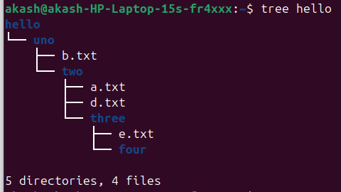

# Drill1

## Folder Creation using mkdir command
* mkdir : helps to make directory. It creates directories on the filesystem.
* -p : it tells mkdir to create a parent directories. If a directory already exists it's not complaint. 
* mkdir -p hello/five/six/seven : a path made of directory names separated by slashes (/). It means a directory named hello, inside it five, inside it six, inside it seven.
* mkdir -p hello/one/two/three/four.
* tree hello : if I want to see the structure of my created directory so use command tree.

## Create Empty files
* touch : creates  an empty file it doesn't exist.
* touch hello/five/six/c.txt
* touch hello/one/a.txt hello/one/b.txt : creation of two empty files together inside a hello/one/.
* touch hello/one/two/d.txt
* touch hello/one/two/three/e.txt
* touch hello/one/two/three/four/access.log
* find hello -type d | sort : it's sort the directory so it's easy to read and understandable.
* find hello -type f | sort : it's sort the files so it's easy to read and understandable.
* I have created 8 directories, 6 files.

## Delete files which belongs to .log extension

### Preview which .log files will be affected
* find hello -type f -name '*.log' -print : hello/one/two/three/four/access.log
* -type f : restricts to files.
* -name '*.log' : matches anything ending with .log.
* *.log : stop the shell from expanding the wildcard to early.
* -print : shows what will be matched.

### Delete them
* find hello -type f -name '*.log' -delete : so it deletes all .log related files.
* Now when you check the whole structure so, the .log file must be deleted.

### Verify
* find hello -type f -name '*.log' -print
* After run command if nothing print then all the .log files are deleted.

## Add content inside .txt files
* cat > hello/one/a.txt << 'EOF' after that on next I have to write some words.

### cat
* cat hello/one/a.txt : displays entire contents of a file.

### head 
* head hello/one/a.txt : shows the first 10 lines by default.
* head -n 1 hello/one/a.txt : shows only first line.

### tail
* tail hello/one/a.txt : shows the last 10 lines by default.
* tail -n 1 hello/one/a.txt : show last 1 line.

### less
* less hello/one/a.txt : opens the file in a scrollable viewer, and useful for long files.

### more
* more hello/one/a.txt : Similar to less, but older. Shows one screen at a time.

### wc (Word Count)
* wc hello/one/a.txt : Counts lines, words, and characters.
* wc -w hello/one/a.txt : count words.
* wc -c hello/one/a.txt : count characters.

### nl (Numbered Lines)
* nl hello/one/a.txt : shows file with line numbers.

### strings
* strings hello/one/a.txt : prints only printable text.

### grep
* grep "Unix" hello/one/a.txt : Search particular words inside the file.

### file
* file hello/one/a.txt : Tells you what kind of file it is (text, binary, etc.).

## Delete the directory/files
* rm -rf hello/five : remove whole content of five.
* rm : remove files/directories.
* -r : means recursive (delete everything inside).
* -f : means force (don't ask, ignore missing files).

## Rename one to uno
* mv hello/one hello/uno : rename the one directory to uno directory.
* mv : moves/renames files or directories.

## Move a.txt to two folder
* mv hello/uno/a.txt hello/uno/two/ 

## Final Output

