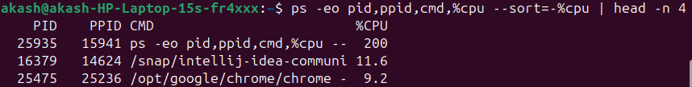
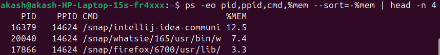

# Drill2

## Pipes

### Download the contents
* wget https://www.gutenberg.org/files/35359/35359.txt -O goblet.txt : it provide a .txt file.
* wget : command to download files from internet.
* URL : points to the book file.
* -0 goblet.txt : save the file as goblet.txt

### Print the first three lines in the book
* head -n 3 goblet.txt : it is a command.
* head : show the top part of a file.
* -n 3 : show only the first 3 lines.

### Print the last 10 points in the book
* tail -n 10 goblet.txt
* tail : shows the bottom part of a file.
* -n 10 : show only the last 10 lines.

### Count occurrences of words
* grep -o "Harry" goblet.txt | wc -l : 1 times
* grep -o "Ron" goblet.txt | wc -l : 0 times
* grep -o "hermione" goblet.txt | wc -l : 0
* grep -o "Dumbledore" goblet.txt | wc -l : 0
* grep -o "is" goblet.txt | wc -l : 1108 times
* grep -o "is" : finds the word and prints each match on a new line.
* | (pipe) : sends the output of ane command into another.
* wc -l : counts how many lines are there, which equals the number of times the word appears.

### Print lines 100 through 200
* sed -n '100,200p' goblet.txt
* sed : stream editor (used for text editing)
* -n : quiet mode, don't print everything.
* '100, 200p' : only print lines between 100 and 200.

### How many unique words are present in the book?
* cat goblet.txt | tr -cs 'a-zA-Z' '\n' | tr 'A-Z' 'a-z' | sort | uniq | wc -l : 3748
* cat goblet.txt : read the book.
* tr -cs 'a-zA-Z' '\n' : keep only letters, replace everything else with new line (so each word goes on a separable line).
* tr 'A-Z' 'a-z' : convert words to lowercase.
* sort : sort the words.
* uniq : remove duplicates.
* wc -l : count the number of unique words.

# Processes, ports

## List your browser's process ids (pid) and parent process ids (ppid)
* ps -C chrome -o pid,ppid,cmd : replace chrome with firefox if you use Firefox.
* ps : shows running processes.
* -C chrome : filter only Chrome browser.
* -o pid,ppid,cmd : show process id, and command.

## Stop the browser application from the command line
* pkill chrome
* pkill : kill processes by name.
* chrome : stops all Chrome processes.

## List of top 3 processes by CPU usage
* ps -eo pid,ppid,cmd,%cpu --sort=-%cpu | head -n 4
  
* ps -eo : display process info.
* pid,ppid,cmd,%cpu : show id, parent id, command, CPU usage.
* --sort=-%cpu : sort by CPU usage (highest first).
* head -n 4 : top 3 + header line.

## List of top 3 processes by memory usage
* ps -eo pid,ppid,cmd,%mem --sort=-%mem | head -n 4
  
* ps -eo : display process info.
* pid,ppid,cmd,%mem : show id, parent id, command, memory usage.
* --sort=-%mem : sort by memory usage (highest first).
* head -n 4 : top 3 + header line.

## Start a Python HTTP server on port 8000
* python3 -m http.server 8000
* http://localhost:8000/ : run this url to get all about the list of directory.
* python3 : this is calls the Python 3 interpreter.
* -m http.server : -m -> run a module as a script, http.server -> is a built-in Python module that provide a very simple HTTP server.
* 8000 : This is the post number the server
